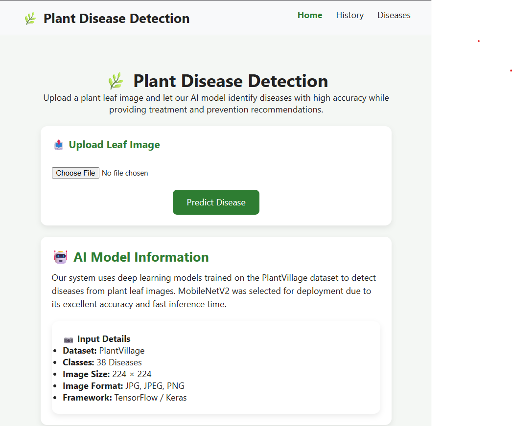
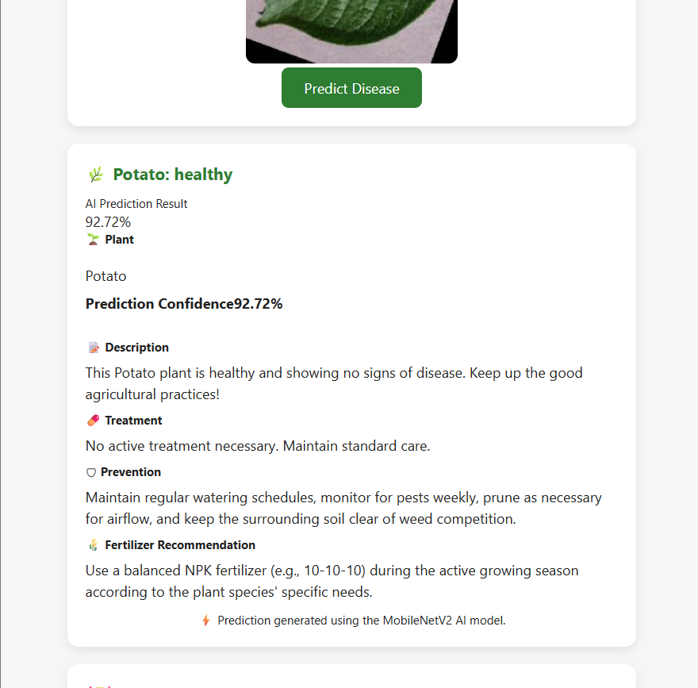
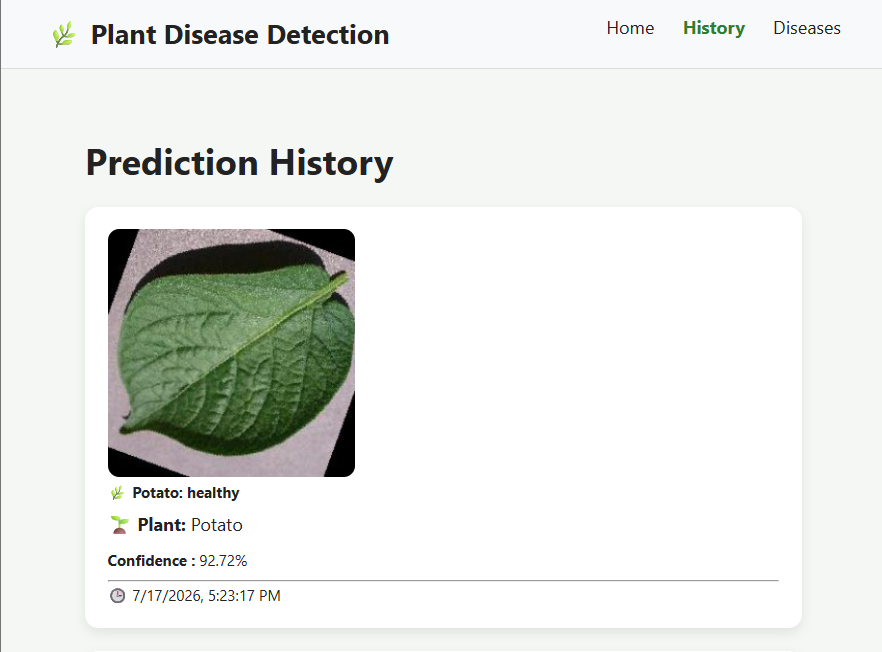
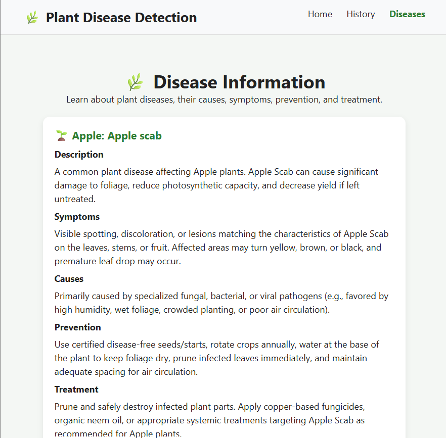

# 🌿 Plant Disease Detection System

<div align="center">


### AI-Powered Plant Disease Detection using Deep Learning

Detect plant diseases from leaf images and receive intelligent treatment, prevention, and fertilizer recommendations.

</div>

---

## 📖 Overview

Plant Disease Detection System is a full-stack AI application that combines **Deep Learning**, **Computer Vision**, and **Web Technologies** to identify plant diseases from leaf images.

The system uses a **MobileNetV2-based Convolutional Neural Network (CNN)** trained on the PlantVillage dataset and provides:

- Disease Prediction
- Confidence Score
- Disease Description
- Treatment Suggestions
- Prevention Recommendations
- Fertilizer Guidance
- Prediction History

This project is designed for:

- Farmers
- Agriculture Researchers
- Students
- Agricultural Startups
- Smart Farming Applications

---

# ✨ Features

## 🤖 AI Disease Detection

- Upload a plant leaf image
- Real-time disease prediction
- Confidence score visualization
- Supports 38 disease classes

## 🌱 Disease Information

- Disease description
- Symptoms
- Causes
- Prevention techniques
- Treatment suggestions

## 💊 Fertilizer Recommendation

- Crop-specific fertilizer guidance
- Disease-based nutrient recommendations

## 📜 Prediction History

- Stores previous predictions
- Image history
- Timestamp tracking

## 📱 Responsive Interface

- Mobile-friendly
- Tablet-friendly
- Desktop optimized

## 🔌 REST API

- Django REST Framework API
- Easy integration with web/mobile apps

---

# 🏗️ System Architecture

```text
┌─────────────────┐
│ React Frontend  │
│     (Vite)      │
└────────┬────────┘
         │ Axios API Calls
         ▼
┌─────────────────────┐
│ Django REST API     │
│ (DRF Backend)       │
└────────┬────────────┘
         │
         ▼
┌─────────────────────┐
│ TensorFlow Model    │
│ MobileNetV2 CNN     │
└────────┬────────────┘
         │
         ▼
┌─────────────────────┐
│ SQLite/PostgreSQL   │
└─────────────────────┘
```

---

# 🌾 Supported Plants & Diseases

| Plant | Classes |
|---------|----------|
| Apple | 4 |
| Blueberry | 1 |
| Cherry | 2 |
| Corn | 4 |
| Grape | 4 |
| Orange | 1 |
| Peach | 2 |
| Pepper | 2 |
| Potato | 3 |
| Raspberry | 1 |
| Soybean | 1 |
| Squash | 1 |
| Strawberry | 2 |
| Tomato | 10 |

### Total Classes

✅ 38 Plant Disease Classes

---

# 📸 Screenshots

## Home Page

```text
[ Upload Plant Image ]
```


## Prediction Result

```text
Disease:
Tomato Early Blight

Confidence:
98.74%

Treatment:
Apply Copper Fungicide

Prevention:
Crop Rotation
```

## Prediction History

```text
Image | Disease | Confidence | Date
```

## Disease Information

```text
Disease
Description
Symptoms
Treatment
Prevention
```

---

# 📂 Project Structure

```text
Plant-Disease-Detection/
│
├── backend/
│   │
│   ├── settings.py
│   ├── urls.py
│   └── wsgi.py
│
├── frontend/
│   │
│   ├── src/
│   │   ├── api/
│   │   │   └── api.js
│   │   │
│   │   ├── components/
│   │   │   ├── Navbar.jsx
│   │   │   ├── ImageUploader.jsx
│   │   │   ├── PredictionCard.jsx
│   │   │   ├── HistoryCard.jsx
│   │   │   └── Loading.jsx
│   │   │
│   │   ├── pages/
│   │   │   ├── Home.jsx
│   │   │   ├── History.jsx
│   │   │   └── DiseaseInfo.jsx
│   │   │
│   │   ├── App.jsx
│   │   ├── main.jsx
│   │   └── index.css
│   │
│   ├── package.json
│   └── vite.config.js
│
├── predictions/
│   ├── migrations/
│   ├── models.py
│   ├── serializers.py
│   ├── views.py
│   ├── urls.py
│   └── admin.py
│
├── media/
├── models/
│   ├── plant_disease_model.keras
│   ├── plant_disease_model.h5
│   └── class_names.json
│
├── requirements.txt
├── screenshots/
├── download_data.py
├── manage.py
├── predict.py
├── train_with_evaluate.py
└── README.md
```

---

# ⚙️ Installation

## 1️⃣ Clone Repository

```bash
git clone https://github.com/buildwithsomnath/plant-disease-detection.git

cd plant-disease-detection
```

---

# Backend Setup

## Create Virtual Environment

### Windows

```bash
python -m venv venv

venv\Scripts\activate
```

### Linux/Mac

```bash
python -m venv venv

source venv/bin/activate
```

---

## Install Dependencies

```bash
pip install -r requirements.txt
```

---

## Run Migrations

```bash
python manage.py makemigrations

python manage.py migrate
```

---

## Create Superuser

```bash
python manage.py createsuperuser
```

---

## Start Backend

```bash
python manage.py runserver
```

Backend URL:

```text
http://127.0.0.1:8000
```

---

# Frontend Setup

```bash
cd frontend

npm install
```

---

## Start Frontend

```bash
npm run dev
```

Frontend URL:

```text
http://localhost:5173
```

---

# 🔌 API Endpoints

## Predict Disease

### POST

```http
/api/predict/
```

### Request

```bash
curl -X POST \
-F "image=@leaf.jpg" \
http://localhost:8000/api/predict/
```

### Response

```json
{
  "success": true,
  "prediction": {
    "disease": "Tomato___Early_blight",
    "confidence": 98.74,
    "plant_type": "Tomato",
    "description": "...",
    "treatment": "...",
    "fertilizer": "...",
    "prevention": "..."
  }
}
```

---

## Prediction History

### GET

```http
/api/history/
```

---

## Prediction Detail

### GET

```http
/api/history/<id>/
```

---

## Disease Information

### GET

```http
/api/diseases/
```

---

## Disease Detail

### GET

```http
/api/diseases/<id>/
```

---

# 🧠 Deep Learning Model

## Architecture

```text
Input Image
    │
    ▼
Resize 224x224
    │
    ▼
MobileNetV2
    │
    ▼
Global Average Pooling
    │
    ▼
Dense Layer
    │
    ▼
Dropout
    │
    ▼
38-Class Softmax
```

---

# 📊 Model Performance

| Metric | Value |
|----------|---------|
| Dataset | PlantVillage |
| Images | 54,000+ |
| Classes | 38 |
| Input Size | 224x224 |
| Framework | TensorFlow |
| Model | MobileNetV2 |
| Accuracy | ~81–84% |

---

# 🛠️ Tech Stack

## Frontend

- React
- Vite
- Axios
- React Router DOM
- CSS

## Backend

- Django
- Django REST Framework
- TensorFlow
- Keras
- Pillow
- NumPy

## Database

- SQLite
- PostgreSQL (Production)

---

# 🚀 Deployment

## Frontend

Deploy on:

- Vercel

```bash
npm run build
```

---

## Backend

Deploy on:

- Railway

Install:

```bash
pip install gunicorn
```

Create Procfile:

```text
web: gunicorn backend.wsgi
```

---

# 🔐 Environment Variables

Create `.env`

```env
SECRET_KEY=your-secret-key

DEBUG=False

ALLOWED_HOSTS=localhost,127.0.0.1

MODEL_PATH=models/plant_disease_model.keras

MAX_UPLOAD_SIZE=5242880
```

---

# 🔮 Future Improvements

- User Authentication
- Multi-language Support
- Weather-based Disease Prediction
- Mobile Application
- Cloud Model Serving
- Explainable AI (Grad-CAM)
- PDF Report Generation
- Farmer Chatbot
- Real-time Camera Detection

---

# 🤝 Contributing

Contributions are welcome.

1. Fork repository
2. Create branch

```bash
git checkout -b feature/new-feature
```

3. Commit

```bash
git commit -m "Added feature"
```

4. Push

```bash
git push origin feature/new-feature
```

5. Create Pull Request

---

# 👨‍💻 Author

### Somnath Das

GitHub:

https://github.com/buildwithsomnath

LinkedIn:

https://linkedin.com/in/buildwithsomnath

Email:

somnathdas4462@gmail.com

---

# 🙏 Acknowledgements

- TensorFlow Team
- Django Community
- React Team
- Kaggle Community

---

# ⭐ Support

If you found this project helpful:

⭐ Star the repository

🍴 Fork the project

📢 Share with others

---

<div align="center">

Made with ❤️ by Somnath Das

</div>